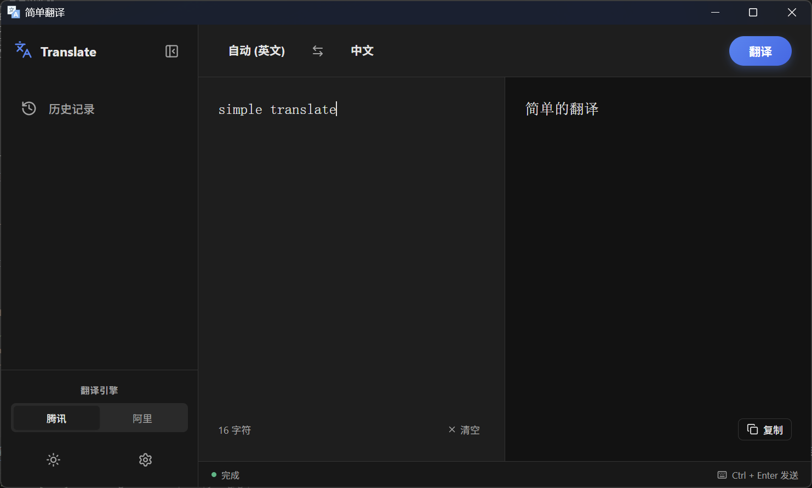
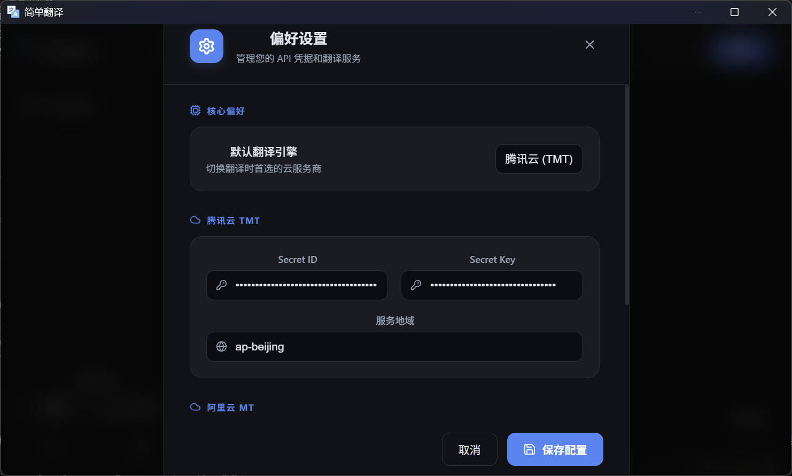

# SimpleTranslate

一个干净清爽的翻译工具




## 简介

SimpleTranslate 是一个基于 Wails 框架开发的桌面翻译应用。后端使用 Go 语言，前端使用 Svelte 框架，提供简洁高效的翻译体验。支持腾讯云和阿里云的翻译服务，能够自动检测语言并进行实时翻译。

## 功能特性

- **多云服务支持**：集成腾讯云翻译和阿里云翻译服务
- **自动语言检测**：支持自动识别源语言
- **实时翻译**：输入文本后即时显示翻译结果
- **多语言支持**：支持中文、英文、日语、韩语、法语、德语、俄语、西班牙语等
- **历史记录**：保存翻译历史，便于回顾
- **配置管理**：用户友好的设置界面，支持暗色模式
- **跨平台**：支持 Windows、macOS 和 Linux

## 安装

### 前置要求

- Go 1.23 或更高版本
- Node.js 16 或更高版本
- npm 或 yarn

### 下载

从 [Releases](https://github.com/dylucas/simpleTranslate/releases) 页面下载对应平台的预编译二进制文件。

### 源码安装

1. 克隆仓库：
   ```bash
   git clone https://github.com/dylucas/simpleTranslate.git
   cd simpleTranslate
   ```

2. 安装 Go 依赖：
   ```bash
   go mod download
   ```

3. 安装前端依赖：
   ```bash
   cd frontend
   npm install
   cd ..
   ```

4. 构建应用：
   ```bash
   wails build
   ```

## 使用

1. 运行应用：
   ```bash
   ./simpleTranslate  # Linux/macOS
   simpleTranslate.exe  # Windows
   ```

2. 配置 API 密钥：
   - 打开设置界面
   - 输入腾讯云或阿里云的 SecretId 和 SecretKey
   - 设置默认翻译引擎

3. 开始翻译：
   - 在输入框中输入要翻译的文本
   - 选择源语言和目标语言（或使用自动检测）
   - 点击翻译按钮或按 Enter 键

## 开发

### 开发环境设置

1. 安装 Wails：
   ```bash
   go install github.com/wailsapp/wails/v2/cmd/wails@latest
   ```

2. 启动开发模式：
   ```bash
   wails dev
   ```

这将启动热重载开发服务器，前端和后端代码的更改会自动反映在应用中。

### 项目结构

```
simpleTranslate/
├── app.go              # 主应用逻辑
├── main.go             # 应用入口
├── config.go           # 配置相关方法
├── translate/          # 翻译服务包
│   ├── aliyun.go       # 阿里云翻译实现
│   └── tencent.go      # 腾讯云翻译实现
├── config/             # 配置工具包
├── frontend/           # 前端代码
│   ├── src/
│   │   ├── App.svelte  # 主 UI 组件
│   │   └── lib/
│   └── package.json
├── build/              # 构建相关文件
└── wails.json          # Wails 配置
```

## 构建

### 开发构建

```bash
wails dev
```

### 生产构建

```bash
# Windows AMD64
wails build -clean -o simpleTranslate-win-amd64.exe -platform windows/amd64

# Windows ARM64
wails build -clean -o simpleTranslate-win-arm64.exe -platform windows/arm64

# macOS AMD64
wails build -clean -o simpleTranslate-mac-amd64 -platform darwin/amd64

# macOS ARM64
wails build -clean -o simpleTranslate-mac-arm64 -platform darwin/arm64
```

构建后的二进制文件位于 `build/bin/` 目录下。

## 配置

应用配置存储在用户主目录下的 `.simple_translate/config.json` 文件中，包括：

- 云服务 API 密钥
- 默认翻译引擎
- UI 设置（暗色模式、侧边栏状态等）

## 贡献

欢迎提交 Issue 和 Pull Request！

1. Fork 本仓库
2. 创建特性分支：`git checkout -b feature/new-feature`
3. 提交更改：`git commit -am 'Add new feature'`
4. 推送分支：`git push origin feature/new-feature`
5. 提交 Pull Request

## 许可证

本项目采用 MIT 许可证 - 查看 [LICENSE](LICENSE) 文件了解详情。

## 致谢

- [Wails](https://wails.io/) - 桌面应用框架
- [腾讯云翻译](https://cloud.tencent.com/product/tmt) - 翻译服务
- [阿里云翻译](https://www.aliyun.com/product/ai/alimt) - 翻译服务