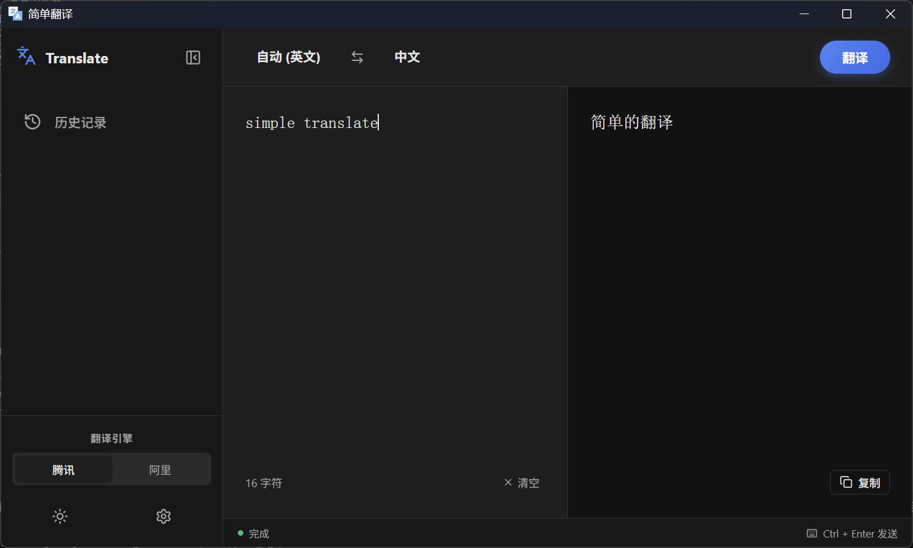
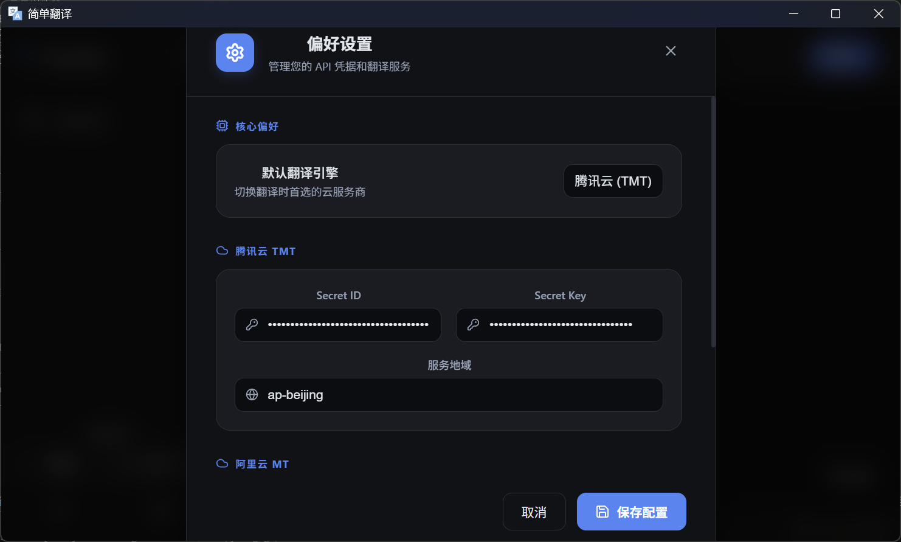

# SimpleTranslate

一个干净清爽的翻译工具




## 简介

SimpleTranslate 是一个基于 Wails 框架开发的桌面翻译应用。后端使用 Go 语言，前端使用 Svelte 框架，提供简洁高效的翻译体验。支持腾讯云和阿里云的翻译服务，能够自动检测语言并进行实时翻译。

## 功能特性

- **多云服务支持**：集成腾讯云翻译和阿里云翻译服务
- **多引擎对比模式**：同一文本并发调用多个引擎，并排展示结果便于择优（单引擎超时 30s 不阻塞整体）
- **自动语言检测**：支持自动识别源语言，跨引擎 best-effort 兜底
- **实时翻译**：输入文本后即时显示翻译结果（700ms 防抖自动翻译，可开关）
- **剪贴板监听**：开启后自动翻译复制的内容（1.5s 轮询，过滤超长文本）
- **结果再翻译**：一键将当前译文作为新输入并交换源/目标语言
- **语音朗读**：基于浏览器 SpeechSynthesis 朗读原文与译文
- **连接测试**：在设置中用最小请求验证凭据是否可用
- **多语言支持**：支持中文、英文、日语、韩语、法语、德语、俄语、西班牙语等
- **历史记录**：本地持久化保存（上限 200 条，防抖写盘），便于回顾
- **配置管理**：用户友好的设置界面，支持暗色 / 浅色模式与侧边栏折叠
- **跨平台**：支持 Windows、macOS 和 Linux

## 安装

### 前置要求

- Go 1.25 或更高版本
- Node.js 16 或更高版本
- npm 或 yarn

### 下载

从 [Releases](https://github.com/dylucas/simpleTranslate/releases) 页面下载对应平台的预编译二进制文件。

### 源码安装

1. 克隆仓库：
   ```bash
   git clone https://github.com/dylucas/simpleTranslate.git
   cd simpleTranslate
   ```

2. 安装 Go 依赖：
   ```bash
   go mod download
   ```

3. 安装前端依赖：
   ```bash
   cd frontend
   npm install
   cd ..
   ```

4. 构建应用：
   ```bash
   wails build
   ```

## 使用

1. 运行应用：
   ```bash
   ./simpleTranslate  # Linux/macOS
   simpleTranslate.exe  # Windows
   ```

2. 配置 API 密钥：
   - 打开设置界面
   - 输入腾讯云或阿里云的 SecretId 和 SecretKey
   - 设置默认翻译引擎，可点击「测试连接」验证凭据

3. 开始翻译：
   - 在输入框中输入要翻译的文本（自动翻译默认开启，输入停顿 700ms 后触发）
   - 选择源语言和目标语言（或使用自动检测）
   - 点击翻译按钮或按 `Ctrl/Cmd + Enter`

4. 进阶用法：
   - **多引擎对比**：在设置中开启对比模式，并选参与的引擎
   - **剪贴板监听**：开启后自动翻译复制内容，无需手动粘贴
   - **结果再翻译**：点击译文上的「再翻译」按钮，把译文作为新输入并交换语言
   - **语音朗读**：点击文本旁的喇叭图标朗读原文 / 译文

   ### 快捷键

   - **Ctrl/Cmd + Enter**: 发送翻译请求
   - **Ctrl/Cmd + L**: 聚焦到输入框
   - **Ctrl/Cmd + K**: 清空输入内容
   - **Ctrl/Cmd + J**: 交换源语言和目标语言
   - **Ctrl/Cmd + Shift + H**: 打开 / 关闭历史记录面板
   - **Ctrl/Cmd + M**: 切换深色 / 浅色主题
   - **Esc**: 关闭弹窗 / 面板

   > 在 macOS 上使用 `Cmd` (⌘) 作为修饰键，其余平台使用 `Ctrl`。

## 开发

### 开发环境设置

1. 安装 Wails：
   ```bash
   go install github.com/wailsapp/wails/v2/cmd/wails@latest
   ```

2. 启动开发模式：
   ```bash
   wails dev
   ```

这将启动热重载开发服务器，前端和后端代码的更改会自动反映在应用中。

### 项目结构

```
simpleTranslate/
├── app.go              # 主应用逻辑（翻译、多引擎并发、历史、连接测试）
├── main.go             # 应用入口
├── config.go           # 配置相关方法（包装 config 包供前端调用）
├── translate/          # 翻译服务包
│   ├── aliyun.go       # 阿里云翻译实现
│   └── tencent.go      # 腾讯云翻译实现
├── config/             # 配置工具包（含进程内缓存）
├── frontend/           # 前端代码
│   ├── src/
│   │   ├── App.svelte      # 主 UI 组件
│   │   └── lib/
│   │       ├── Config.svelte     # 设置弹窗
│   │       ├── History.svelte    # 历史记录抽屉
│   │       └── store.ts          # 配置响应式 store
│   ├── DESIGN_SYSTEM.md  # 设计系统规范文档
│   └── package.json
├── build/              # 构建相关文件
└── wails.json          # Wails 配置
```

## 构建

### 开发构建

```bash
wails dev
```

### 生产构建

```bash
# Windows AMD64
wails build -clean -o simpleTranslate-win-amd64.exe -platform windows/amd64

# Windows ARM64
wails build -clean -o simpleTranslate-win-arm64.exe -platform windows/arm64

# macOS AMD64
wails build -clean -o simpleTranslate-mac-amd64 -platform darwin/amd64

# macOS ARM64
wails build -clean -o simpleTranslate-mac-arm64 -platform darwin/arm64
```

构建后的二进制文件位于 `build/bin/` 目录下。

## 配置

应用配置存储在用户主目录下的 `.simple_translate/config.json` 文件中（0600 权限，进程内缓存避免频繁读盘），包括：

- 云服务 API 密钥（腾讯云 / 阿里云的 SecretId、SecretKey、Region）
- 默认翻译引擎（`tencent` / `aliyun`）
- 多引擎对比设置（`compareMode`、`compareEngines`）
- 剪贴板监听开关（`clipboardWatch`）
- UI 设置（暗色模式、侧边栏折叠状态等）

历史记录独立存储于同目录的 `history.json`，上限 200 条。

UI 设计规范参见 [frontend/DESIGN_SYSTEM.md](frontend/DESIGN_SYSTEM.md)。

## 贡献

欢迎提交 Issue 和 Pull Request！

1. Fork 本仓库
2. 创建特性分支：`git checkout -b feature/new-feature`
3. 提交更改：`git commit -am 'Add new feature'`
4. 推送分支：`git push origin feature/new-feature`
5. 提交 Pull Request

## 许可证

本项目采用 MIT 许可证 - 查看 [LICENSE](LICENSE) 文件了解详情。

## 致谢

- [Wails](https://wails.io/) - 桌面应用框架
- [腾讯云翻译](https://cloud.tencent.com/product/tmt) - 翻译服务
- [阿里云翻译](https://www.aliyun.com/product/ai/alimt) - 翻译服务
